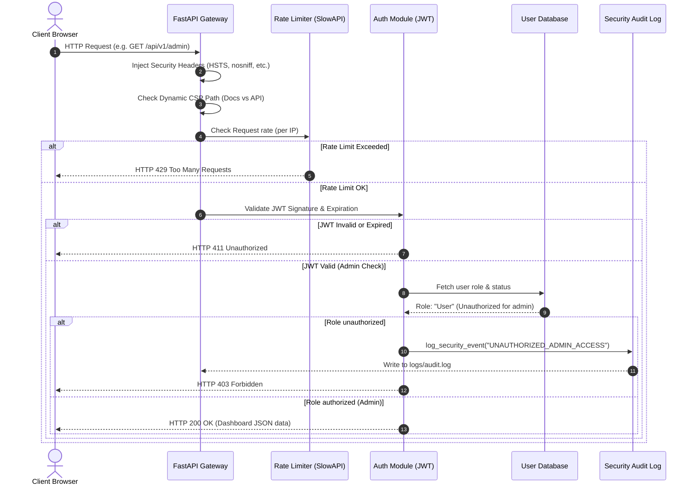

# 🛡️ Minimalist & Secure REST API (FastAPI)

[](https://python.org)
[](https://fastapi.tiangolo.com)
[](#-security-hardening-details)

A minimalist, high-performance, and hardened REST API built with **Python (FastAPI)**. This project demonstrates backend security engineering best practices, including **Identity & Access Management (IAM)**, **Role-Based Access Control (RBAC)**, **Security Audit Logging**, **Rate Limiting (Brute-Force defense)**, and defensive HTTP security headers.

> [!NOTE]
> This API serves as a secure backend/control plane or administrative gateway. It is designed to complement network security automation scripts, central monitoring dashboards, and intrusion detection logs (such as PCAP parsers).

---

## 📐 Architecture & Security Flow

Below is the request-response lifecycle illustrating the zero-trust architecture. Every request passes through rate limiting, security header injections, dynamic Content Security Policy (CSP) path checks, signature validation, and role checkpoints.



---

## 🔒 Security Hardening Details

### 1. Zero-Trust Authentication (AuthN)
*   **Cryptographic Password Hashing**: Passwords are never stored in plaintext. They are hashed using **Bcrypt** with salt rounds (work factor) of `12` (`bcrypt.gensalt(rounds=12)`). This provides robust defense against GPU-accelerated offline cracking attempts.
*   **Cryptographically Signed JWT Sessions**: Successful logins issue a **JSON Web Token (JWT)** signed using **HMAC SHA-256 (HS256)** and a server-side `SECRET_KEY`. The tokens are short-lived (expiry set to `15 minutes`) to minimize the impact of token interception.

### 2. Granular Role-Based Access Control (RBAC)
*   **Role Checkpoint Dependencies**: Route access is protected using reusable FastAPI dependencies.
*   **Access Tiers**:
    *   `/api/v1/dashboard`: Accessible to both `User` and `Admin` roles.
    *   `/api/v1/admin`: Accessible **strictly** to the `Admin` role.
*   **Defensive Rejections**: Any attempts by a standard `User` to access administrative paths are met with an immediate `403 Forbidden` response and an automated security event trigger.

### 3. Isolated Security Audit Logging
*   **Intrusion Detection Trail**: Security violations and authentication lifecycle events are logged to a dedicated, isolated file: `logs/audit.log`.
*   **Log Rotation Defense**: Utilizes a `RotatingFileHandler` configured to roll over at `10MB` and keep up to `5 backups`, mitigating storage-depletion Denial of Service (DoS) attacks.
*   **Logged Events**:
    *   `REGISTER_SUCCESS` / `REGISTER_FAILED`
    *   `LOGIN_SUCCESS` / `FAILED_LOGIN_ATTEMPT` (logs offending username and client IP)
    *   `UNAUTHORIZED_ADMIN_ACCESS` (logs source IP, offending username, and target endpoint)

### 4. Custom HTTP Security Middleware (Helmet Equivalent)
An ASGI middleware intercepts all outbound responses to inject browser security directives:
*   `Strict-Transport-Security (HSTS)`: Forces secure HTTPS connections (`max-age=31536000; includeSubDomains`).
*   `X-Content-Type-Options`: Set to `nosniff` to prevent browser MIME-type sniffing.
*   `X-Frame-Options`: Set to `DENY` to defend against clickjacking attacks.
*   `X-XSS-Protection`: Set to `1; mode=block` for older legacy browser filters.
*   `Referrer-Policy`: Set to `no-referrer` to prevent leaking referral credentials.
*   **Dynamic Content Security Policy (CSP)**:
    *   For documentation paths (`/docs`, `/redoc`, `/openapi.json`), the policy permits Swagger CDN assets (`cdn.jsdelivr.net`) and FastAPI assets (`fastapi.tiangolo.com`).
    *   For all other production API endpoints, the policy reverts to an ultra-strict `"default-src 'self'; frame-ancestors 'none';"` to completely isolate the API from external scripts.

### 5. IP-Based Rate Limiting
*   Protects the authentication gate `/api/v1/auth/login` using `slowapi` (IP-based token bucket tracking).
*   Limits login queries to **`5 attempts per minute`** per client IP, preventing brute-force dictionary attacks.

---

## 📂 Project Structure
```text
.
├── app/
│   ├── __init__.py
│   ├── main.py          # FastAPI application, middlewares & routes
│   ├── config.py        # Settings management (Pydantic Settings)
│   ├── auth.py          # Hashing, JWT processing & security dependencies
│   ├── database.py      # Thread-safe in-memory User Database (singleton)
│   ├── schemas.py       # Pydantic input/output schemas & regex validation
│   └── logger.py        # Security audit log configuration
├── logs/
│   └── audit.log        # Target file for security events
├── tests/
│   └── test_api.py      # Automated security verification test suite
├── .env                 # Environment variables and secrets
├── requirements.txt     # Python package dependencies
└── README.md            # Portfolio documentation
```

---

## 🚀 Setup & Installation

### 1. Prerequisites
*   Python 3.12+

### 2. Environment Setup
Clone this repository to your local machine:
```bash
# Create a virtual environment
python3 -m venv .venv

# Activate the virtual environment
source .venv/bin/activate

# Install dependencies
pip install -r requirements.txt
```

### 3. Start the Server
Run the Uvicorn ASGI server with hot-reload enabled:
```bash
PYTHONPATH=. uvicorn app.main:app --reload
```
The server will bind to `http://127.0.0.1:8000`. Visiting the root URL `http://127.0.0.1:8000/` will automatically redirect you to the documentation UI.

---

## 🧪 Automated Testing
An automated security verification test suite covers all requirements:
1.  **Security Headers check**: Asserts HSTS, CSP, and Clickjacking headers are correctly set.
2.  **Registration constraints**: Tests password length requirements, username format filters, and role restrictions.
3.  **Audit trail logic**: Validates that failed authentication queries create structured logs containing IPs, usernames, and timestamped actions.
4.  **RBAC logic**: Confirms `User` accesses `/dashboard` successfully but receives `403 Forbidden` on `/admin`, while `Admin` accesses both.
5.  **Rate limiting logic**: Tests that rapid login requests from a single client trigger a `429` block.
6.  **Root Redirect check**: Asserts that visits to `/` redirect to `/docs` cleanly.

Run the tests:
```bash
PYTHONPATH=. .venv/bin/pytest tests/test_api.py -v
```

---

## 📊 Security Logs Sample
Sample entries from `logs/audit.log`:
```text
[2026-06-08 21:01:03,414] SECURITY_AUDIT | IP: 127.0.0.1 | User: Farhad03 | Event: REGISTER_SUCCESS | User registered successfully with role 'Admin'.
[2026-06-08 21:02:37,139] SECURITY_AUDIT | IP: 127.0.0.1 | User: Farhad | Event: REGISTER_SUCCESS | User registered successfully with role 'User'.
[2026-06-08 21:06:12,234] SECURITY_AUDIT | IP: 127.0.0.1 | User: Farhad | Event: UNAUTHORIZED_ADMIN_ACCESS | Access denied: user attempted to access admin panel without required privileges.
```
