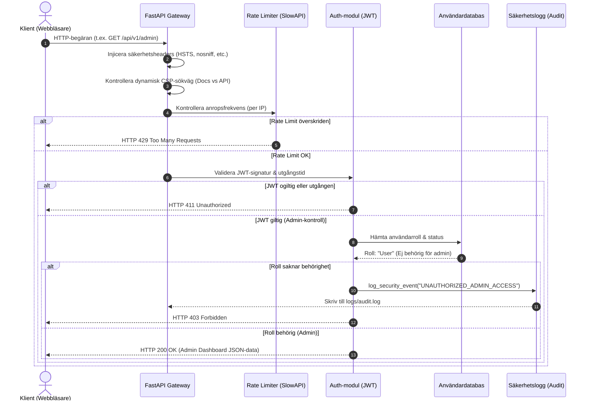

# Minimalistiskt & Säkert REST API (FastAPI)

[Read in English](README.md)

[](https://python.org)
[](https://fastapi.tiangolo.com)
[](#-säkerhetshärdning-i-detalj)

Ett minimalistiskt, högpresterande och härdat REST API byggt med **Python (FastAPI)**. Detta projekt demonstrerar bästa praxis för backend-säkerhet, inklusive **Identity & Access Management (IAM)**, **rollbaserad behörighetskontroll (RBAC)**, **säkerhetsloggning (audit logs)**, **Rate Limiting (skydd mot brute-force)** och defensiva HTTP-säkerhetsheaders.

> [!NOTE]
> Detta API fungerar som en säker backend, kontrollpanel eller administrativ gateway. Det är utformat för att komplettera nätverkssäkerhetsprojekt, centrala övervakningspaneler och loggar för intrångsdetektering (såsom PCAP-parsers).

---

## Arkitektur & Säkerhetsflöde

Nedan visas livscykeln för en HTTP-förfrågan och hur zero-trust-arkitekturen är uppbyggd. Varje förfrågan passerar genom rate-limiting, injicering av säkerhetsheaders, kontroll av Content Security Policy (CSP), signaturverifiering och rollbaserade kontrollstationer.



---

## Säkerhetshärdning i detalj

### 1. Zero-Trust Autentisering (AuthN)
*   **Kryptografisk lösenordshashning**: Lösenord lagras aldrig i klartext. De hashas med **Bcrypt** med saltrundor (work factor) inställd på `12` (`bcrypt.gensalt(rounds=12)`). Detta ger ett starkt skydd mot offline-attacker med specialiserad hårdvara (t.ex. GPU-kluster).
*   **Signerade JWT-sessioner**: Lyckade inloggningar utfärdar en **JSON Web Token (JWT)** signerad med **HMAC SHA-256 (HS256)** och en hemlig nyckel (`SECRET_KEY`). Tokens har en kort livslängd (utgår efter **15 minuter**) för att minimera riskerna om en token skulle bli stulen.

### 2. Rollbaserad behörighetskontroll (RBAC / AuthZ)
*   **Behörighetskontroller**: Sökvägar skyddas med återanvändbara FastAPI-dependencies.
*   **Behörighetsnivåer**:
    *   `/api/v1/dashboard`: Tillgänglig för både `User` och `Admin`.
    *   `/api/v1/admin`: Tillgänglig **endast** för rollen `Admin`.
*   **Defensiva avvisningar**: Om en vanlig `User` försöker nå admin-sökvägar avvisas anropet direkt med `403 Forbidden` och händelsen loggas som en säkerhetsincident.

### 3. Isolerad säkerhetsloggning (Audit Logging)
*   **Intrångsspårning**: Säkerhetsincidenter och autentiseringshändelser sparas i en separat loggfil: `logs/audit.log`.
*   **Loggrotation**: Använder `RotatingFileHandler` inställd på att rotera vid `10MB` och spara upp till `5 historiska filer`. Detta skyddar mot att disken blir full under en överbelastningsattack (DoS).
*   **Loggade händelser**:
    *   `REGISTER_SUCCESS` / `REGISTER_FAILED`
    *   `LOGIN_SUCCESS` / `FAILED_LOGIN_ATTEMPT` (loggar målanvändarnamn och klientens IP-adress)
    *   `UNAUTHORIZED_ADMIN_ACCESS` (loggar käll-IP, användarnamn och den sökta endpointen)

### 4. HTTP-säkerhetsheaders (Motsvarighet till Helmet)
En anpassad middleware interceptar alla utgående svar för att lägga till webbläsardirektiv som härdar klienten:
*   `Strict-Transport-Security (HSTS)`: Tvingar fram HTTPS-anslutningar (`max-age=31536000; includeSubDomains`).
*   `X-Content-Type-Options`: Satt till `nosniff` för att förhindra MIME-sniffing.
*   `X-Frame-Options`: Satt till `DENY` för att förhindra clickjacking.
*   `X-XSS-Protection`: Satt till `1; mode=block` som skydd för äldre webbläsare.
*   `Referrer-Policy`: Satt till `no-referrer` för att inte läcka känsliga URL-parametrar.
*   **Dynamisk Content Security Policy (CSP)**:
    *   För dokumentationssidor (`/docs`, `/redoc`, `/openapi.json`) tillåts nödvändiga skript från Swagger CDN (`cdn.jsdelivr.net`) och FastAPI-resurser.
    *   För alla andra API-anrop används en strikt `"default-src 'self'; frame-ancestors 'none';"`-policy för att helt stänga ute externa skript.

### 5. IP-baserad Rate Limiting
*   Skyddar inloggningsporten `/api/v1/auth/login` med hjälp av `slowapi`.
*   Begränsar inloggningsförsök till **`5 anrop per minut`** per klient-IP för att stoppa brute force- och ordboksattacker.

---

## Projektstruktur
```text
.
├── app/
│   ├── __init__.py
│   ├── main.py          # FastAPI app, middlewares & rutter
│   ├── config.py        # Hantering av miljövariabler (Pydantic Settings)
│   ├── auth.py          # Hashing, JWT-logik & behörighetsdependencies
│   ├── database.py      # Trådsäker in-memory användardatabas (singleton)
│   ├── schemas.py       # Pydantic input/output schemas & regex-validering
│   └── logger.py        # Säkerhets-audit-loggning
├── logs/
│   └── audit.log        # Loggfil för säkerhetshändelser
├── tests/
│   └── test_api.py      # Automatiserad säkerhetstestsvit
├── .env                 # Miljövariabler och hemligheter
├── requirements.txt     # Python-paket
└── README.md            # Dokumentation (Engelska)
└── README.sv.md         # Dokumentation (Svenska)
```

---

## Installation & Konfiguration

### 1. Förutsättningar
*   Python 3.12+

### 2. Konfigurera miljön
Kloningsinstruktioner och uppsättning av virtuell miljö:
```bash
# Skapa en virtuell miljö
python3 -m venv .venv

# Aktivera den virtuella miljön
source .venv/bin/activate

# Installera beroenden
pip install -r requirements.txt
```

### 3. Starta servern
Kör igång Uvicorn-servern:
```bash
PYTHONPATH=. uvicorn app.main:app --reload
```
Servern körs på `http://127.0.0.1:8000`. Om du besöker startsidan `http://127.0.0.1:8000/` skickas du automatiskt direkt till Swagger-dokumentationen.

---

## Automatiserade tester
Testsviten täcker alla säkerhetskrav:
1.  **Säkerhetsheaders**: Kontrollerar HSTS, CSP, och clickjacking-headers.
2.  **Registreringsfilter**: Testar lösenordslängd, tillåtna tecken i användarnamn och rollbegränsningar.
3.  **Audit-loggar**: Validerar att misslyckade inloggningar skapar korrekta loggar i `logs/audit.log`.
4.  **RBAC-åtkomst**: Bekräftar att `User` nekas tillträde till `/admin` med en `403` men kommer åt `/dashboard`, medan `Admin` når båda.
5.  **Rate limiting**: Testar att för många inloggningsförsök blockeras med statuskod `429`.
6.  **Redirect**: Kontrollerar att `/` skickas till `/docs`.

Kör testerna med:
```bash
PYTHONPATH=. .venv/bin/pytest tests/test_api.py -v
```
